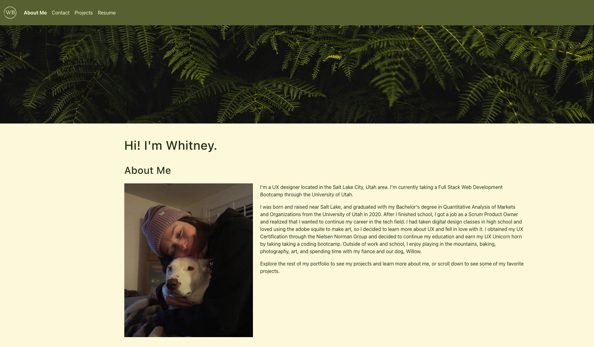
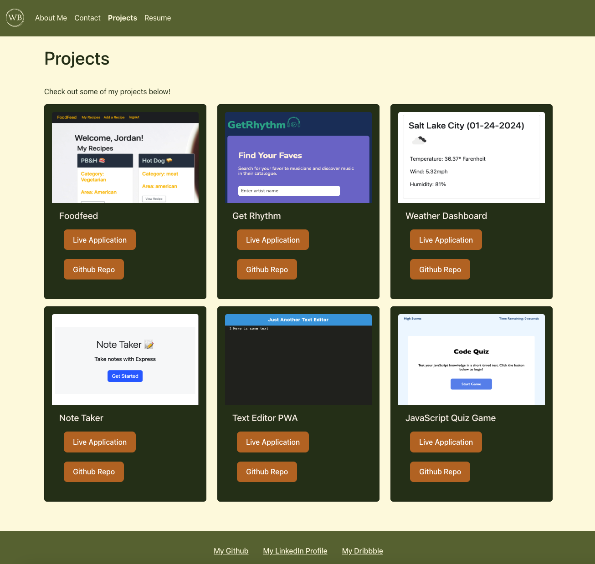
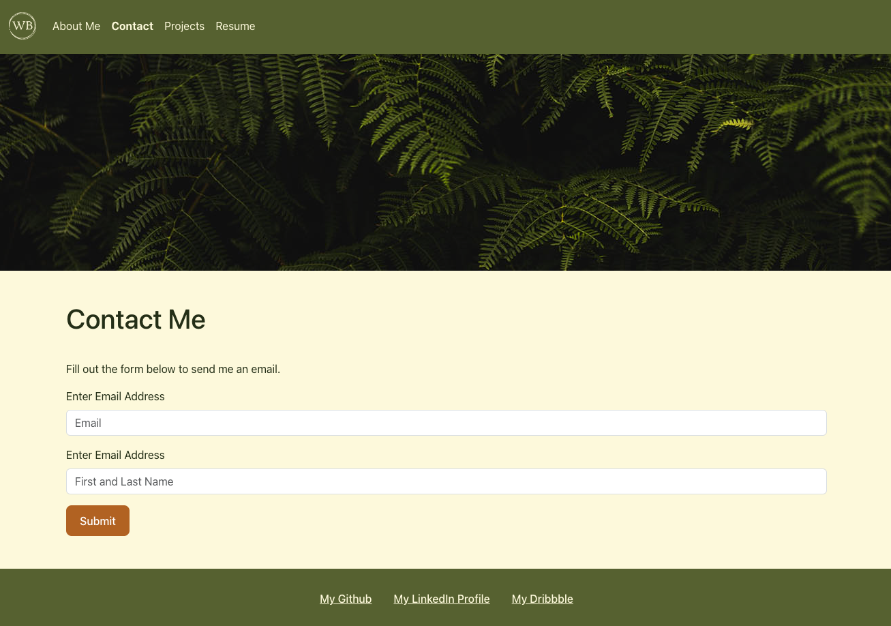

# My Portfolio

## Description

I created this portfolio to showcase some of my software development skills to potential employers. This portfolio features a react.js framework with bootstrap components and some custom styling.

Live Application:

## Installation

This project can be cloned to your machine by visiting my github repo: https://github.com/whitbreezy/portfolio

## Usage

Visit my live portfolio at the following URL: 

Users can navigate through my portfolio using the nav at the top of each page. The About (home) page features some information about me, the Contact page contains a form where users can fill out information to contact me, the Projects page features 6 of my favorite projects, and the Resume page features some highlights from my resume and gives the user the option to view my full resume in Google Docs. Below are some screenshots of some pages within my portfolio.

About Me Page

Projects Page

Contact Form

## Credits

I used some code from module 20 activities from my bootcamp course notes as a starting point for this project and customized it to fit my needs.

The header image is from Pexels, an open source photo website. 

